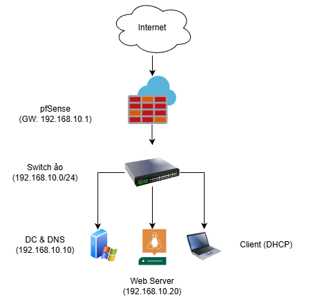
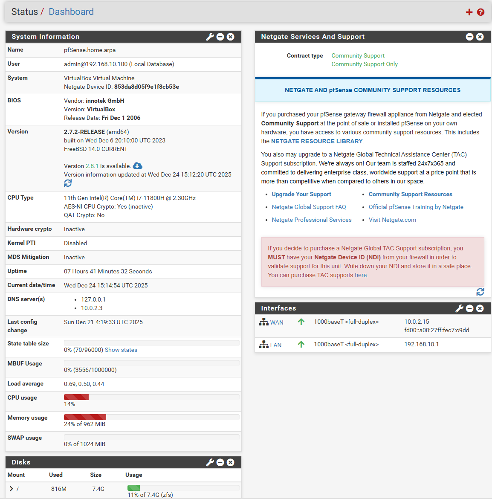
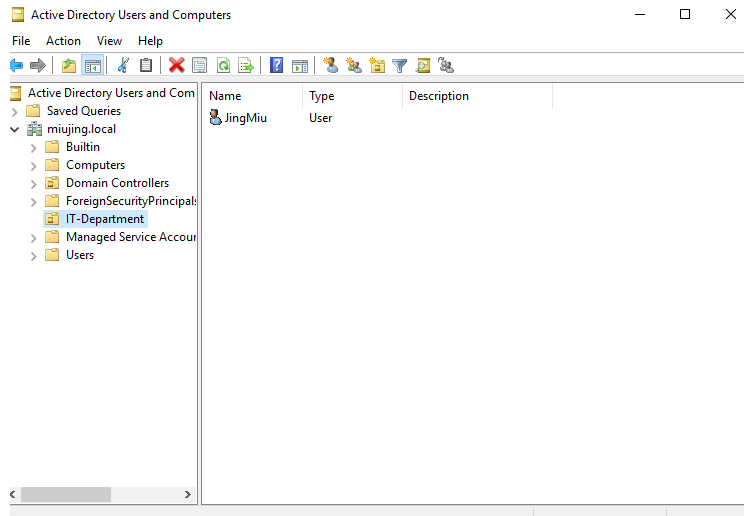
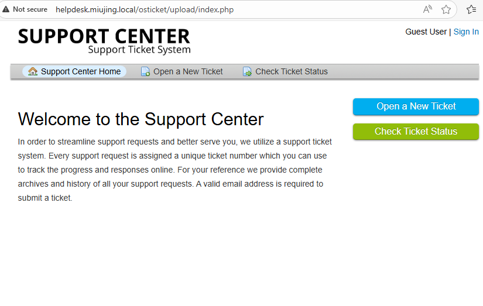
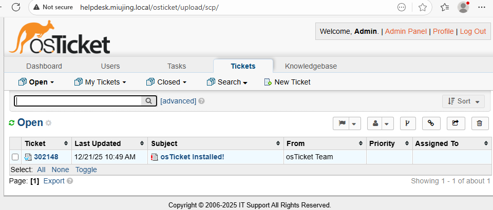
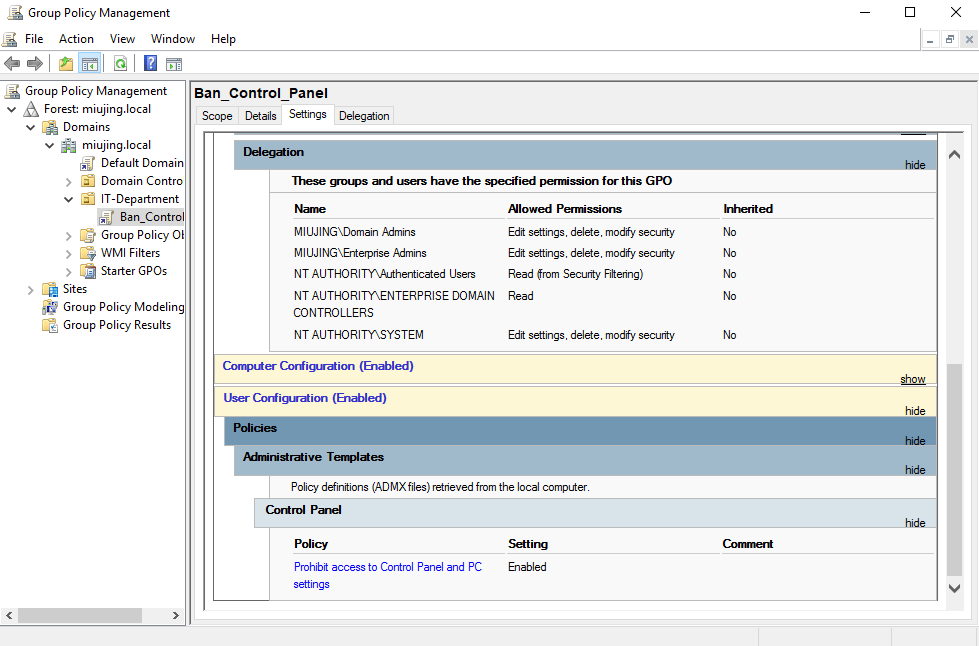

# Enterprise Hybrid IT Infrastructure & Helpdesk System

## 📖 Project Overview
This project simulates a real-world corporate IT environment, integrating **Windows Server (Active Directory)** and **Linux (LAMP Stack)** to host a functional Helpdesk ticketing system. The infrastructure is secured by an edge firewall (pfSense) and features automated maintenance scripts.

## 🏗️ Network Topology


## 🛠️ Technologies Used
- **Infrastructure:** VirtualBox, pfSense (Firewall/Router).
- **Identity Management:** Windows Server 2019 (AD DS, DNS, GPO).
- **Web Server:** Ubuntu Server 20.04, Apache, MySQL, PHP (LAMP Stack).
- **Application:** osTicket (Helpdesk System).
- **Automation:** Python (Service Monitoring), Bash Shell (Database Backup).

## 🚀 Key Features
1.  **Hybrid Environment:** Seamless integration between Windows Domain Controller and Linux Web Server.
2.  **Centralized Management:** Users and Policies managed via Active Directory & Group Policy (GPO).
3.  **Network Security:** Traffic segmented and filtered via pfSense Firewall; Internal DNS resolution.
4.  **Self-Healing System:**
    - Python script monitors Apache service status every minute.
    - Automatically restarts the service if a crash is detected.
5.  **Automated Disaster Recovery:** Daily Cronjob backups of the MySQL database.

## 📂 Project Structure
```text
├── configs/            # Configuration snippets (DNS, Crontab)
├── docs/               # Screenshots and Network Diagrams
├── scripts/            # Automation scripts (Python/Bash)

└── README.md           # Project Documentation
```

## 📸 Screenshots

### 1. pfSense Dashboard
*Firewall configured with WAN/LAN interfaces and Gateway enabled.*


### 2. Active Directory & DNS
*User management setup on Windows Server (Domain Controller).*


### 3. Helpdesk Interface
*The system provides distinct interfaces for End-Users and Administrators, ensuring a streamlined support workflow.*

#### A. End-User Portal (Ticket Submission)
*Interface for employees to submit incident reports and track ticket status.*


#### B. Agent Panel (Ticket Management)
*Dashboard for IT staff to triage, prioritize, and resolve incoming support requests.*


### 4. Group Policy (GPO)
*Security settings to restrict Control Panel access.*


## ⚙️ Setup & Installation Summary
1.  **Network Setup:** Configured pfSense with WAN (NAT) and LAN (`192.168.10.1/24`).
2.  **Domain Controller:** Promoted Windows Server to DC (`miujing.local`), configured DNS A Records for the web server.
3.  **Web Server:** Installed LAMP stack on Ubuntu, deployed osTicket, and joined the network.
4.  **Automation:** Deployed scripts to `/home/sysadmin/` and configured Crontab for daily backups and health checks.

---
*Created by Tran Trong Tin*


